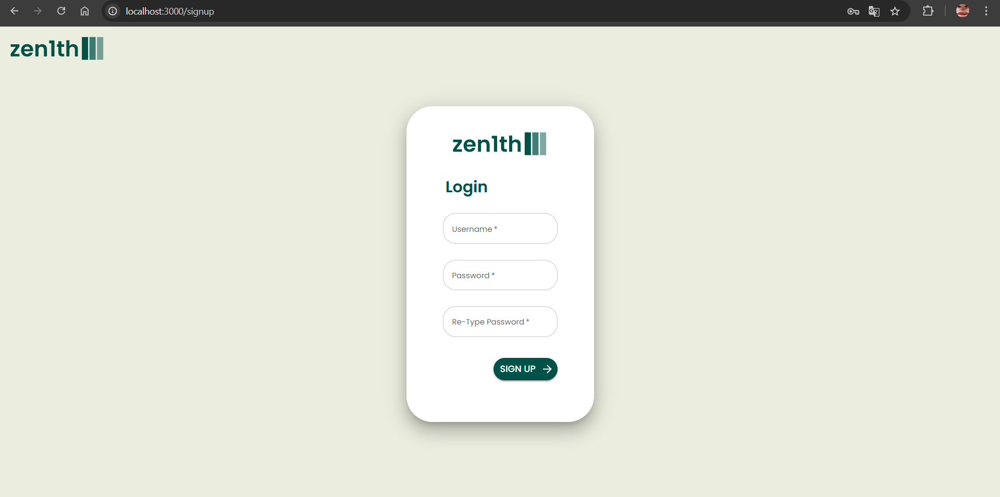
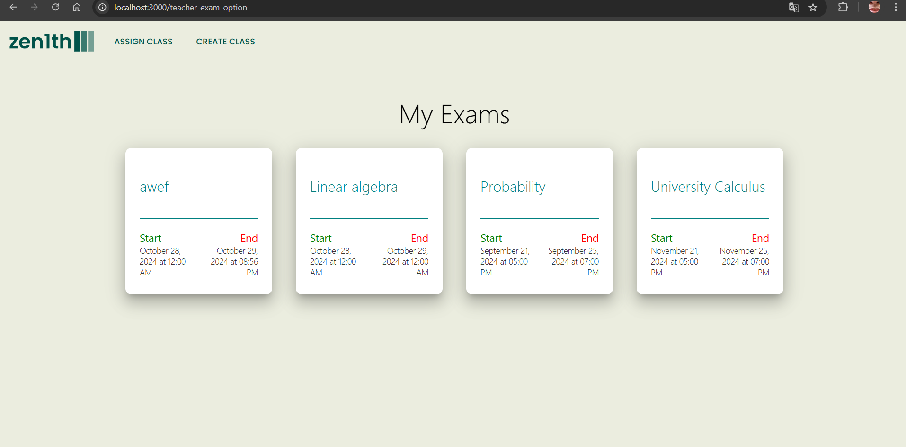
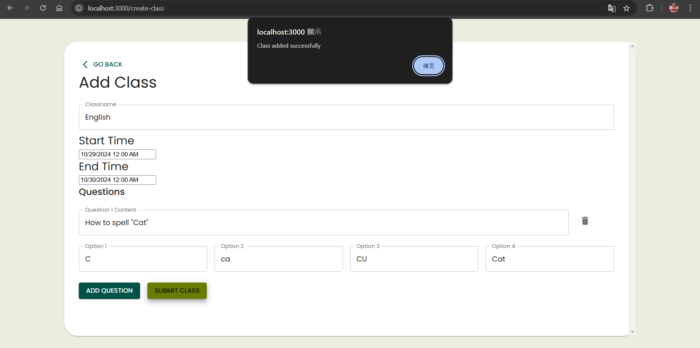
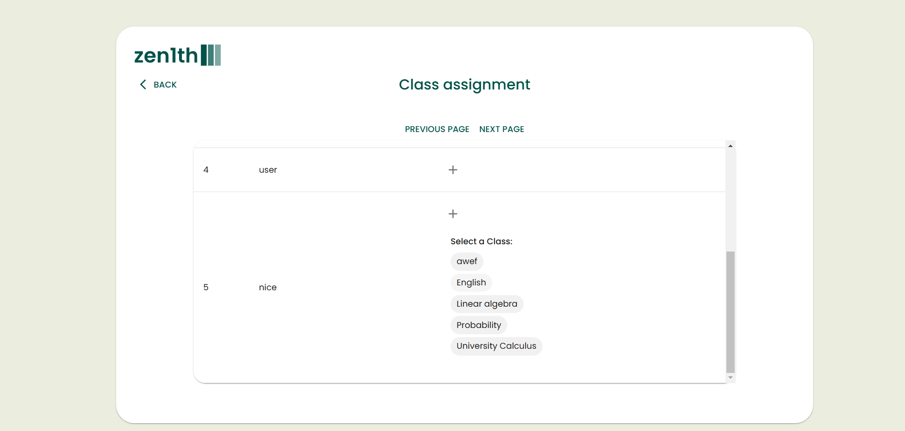
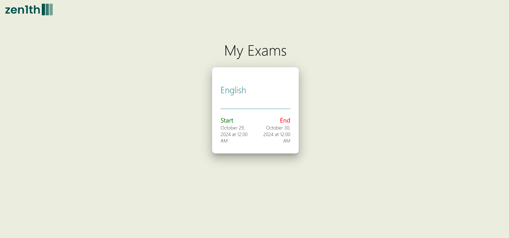
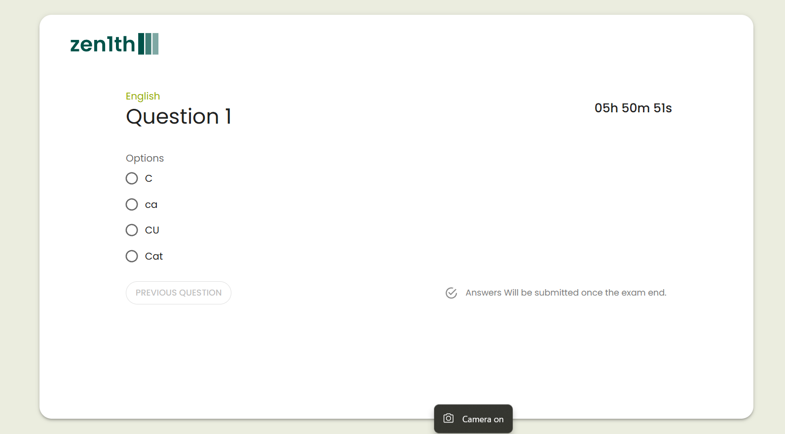
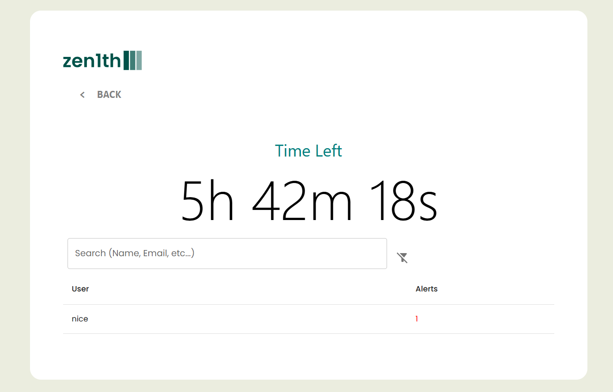
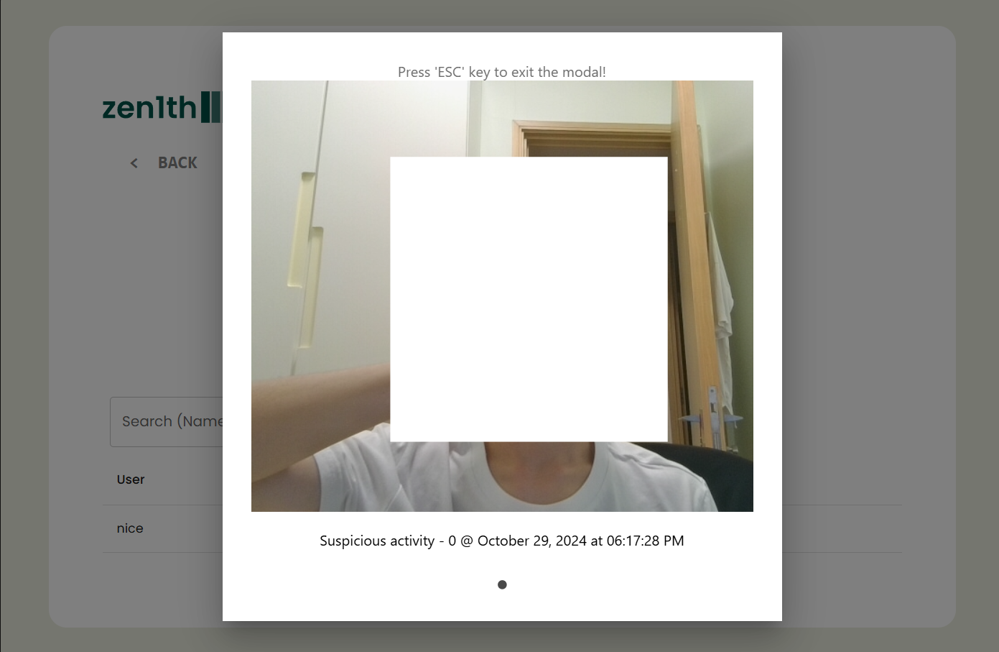

# Team Zen1th - Online Exam Cheating Detection
We created a platform for teachers to monitor students in an online exam and check the whether the student is cheating in the exam 

## Running the Application
The application consists of a SQL Database, a Redis Cache, a Springboot Backend and a React Frontend. Which could be simply ran with docker compose.
1. Open the terminal and clone the repository.
```sh
git clone https://github.com/doughnut923/pwc-winner-2024.git
```
2. Install [docker](https://docs.docker.com/get-started/get-docker/). 
3. Run the server.
```sh
docker-compose up -d
```
You may need to add sudo in front of the command if you haven't set up docker user permission group.


## Using the Application

### 1. Registering for a Teacher Account

A teacher account should first be created in order to create and assign the class the the student. once your reach `{your_address}/`, you will be greeted with a login page. Click Sign Up and enter the credentials, click Sign up again. Then you will be prompted to provide face ID, make sure you gave access to the application to access your camera, after aligning the camera to your face, Click done. Then a account would be created.



### 2. Adding a Teacher Role

This application is still in development. To add teacher authority to a user
1. Connect to the SQL Database named `examappdb` with `localhost:3306` with the password and username shown in `compose.yaml` using a method of interest(e.g. [sqlyog](https://github.com/webyog/sqlyog-community/wiki/Downloads))
2. Under the `t_authority` table, change the value of `permission` to `teacher` for the newly create account. Then apply the changes to the database.

### 3. Create student accounts

Create a student account just like creating a teacher account, but without changing the authority group in sql, as new users are defaulted to be students.


### 4. Create and assgining classes
Login with a teacher's account to access the Teacher's main page.



click Create Class to create a exam, enter the classname and exam start time and click submit class, go back to the teacher's main page and you should see a class show up.



Then click assign classes, click the `+` button on the student you would like to aassign class for. Select the class your would like to add and the class permission should be added.  **(KNOWN BUG: Sometimes newly assigned class would not be displayed. Don't assign same class to people multiple times.)**



### 5. Access the class

For students, they can now see the class they are able to take. Click on one of the classes and they should be good to go.



### 6. Taking the exam
After redirected to the exampage. They are allow to check if their camera works. If the exam has not started yet, you will be greeted with a countdown page. Once the countdown is reached, it automatically refereshes and shows the questions. Once the exam end time is reached, the students are not allowed to access the exam anymore and be redirected to the login page.



### 7. Monitoring the Exam

For the teacher, in the teach's main page, click on the class created. A dashboard could be seen and student cheating could be inspected by clicking on alerts.

