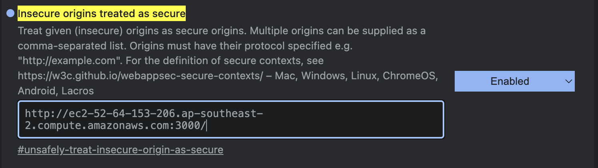
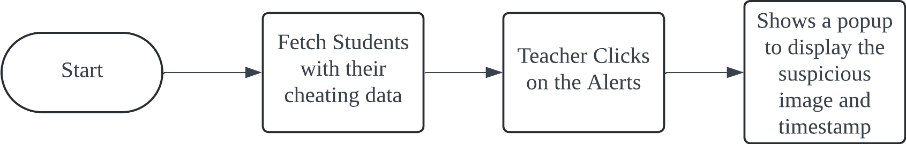

# Team Zen1th - Online Exam Cheating Detection
We created a platform for teachers to monitor students in an online exam and check the whether the student is cheating in the exam.<br/>
**Please refresh if something doesn't go as intended!**

## ## Running the Application without AWS facial recognition services
1. Open the terminal and clone the repository.
```sh
git clone https://github.com/Jacky-020/PwC-2024-Hackaday---Zen1th
```
2. Install [docker](https://docs.docker.com/get-started/get-docker/).
3. Run the server with docker.

## Running the Application with AWS facial recognition services
The application consists of a SQL Database, a Redis Cache, a Springboot Backend and a React Frontend. Which could be simply ran with docker compose.
1. Open the terminal and clone the repository.
```sh
git clone https://github.com/doughnut923/pwc-winner-2024.git
```
2. Install [docker](https://docs.docker.com/get-started/get-docker/). 
3. Setup [AWS Rekignition](https://docs.aws.amazon.com/rekognition/latest/dg/setting-up.html)
4. Change the necessary variables in `compose.yaml` especially the AWS credentials. 
5. Run the server.
```sh
docker-compose up -d
```
You may need to add sudo in front of the command if you haven't set up docker user permission group.


## Using the Application
Webpage Link:  <br/>
[http://localhost:3000/ ] (without AWS)<br/>
[http://ec2-52-64-153-206.ap-southeast-2.compute.amazonaws.com:3000/ ]  (with AWS service set)<br/>
- Please use Google Chrome to access this page.
- Before accessing the webpage, access [chrome://flags/#unsafely-treat-insecure-origin-as-secure]
- Add the address of the web

- Click relaunch
- Access the webpage

### 1a. Sign in to teacher account
- Username: root
- Password: root
- The face ID is bypassed for this account, as this account is for demonstration purposes only.

### 1b. Sign up for a student account

- Username: Jacky
- Password: 111111
- The face ID is bypassed for this account, as this account is for demonstration purposes only.

<br/> P.S. This is a demo account, please do not implement this for any real-world application.

### 2. Create student accounts

Create a student account just like creating a teacher account, but without changing the authority group in sql, as new users are defaulted to be students.


### 3. Create and assgining classes
Login with a teacher's account to access the Teacher's main page.


click Create Class to create a exam, enter the classname and exam start time and click submit class, go back to the teacher's main page and you should see a class show up.


Then click assign classes, click the `+` button on the student you would like to aassign class for. Select the class your would like to add and the class permission should be added.  **(KNOWN BUG: Sometimes newly assigned class would not be displayed. Don't assign same class to people multiple times.)**


### 4. Access the class

For students, they can now see the class they are able to take. Click on one of the classes and they should be good to go.


### 5. Taking the exam
After redirected to the exampage. They are allow to check if their camera works. If the exam has not started yet, you will be greeted with a countdown page. Once the countdown is reached, it automatically refereshes and shows the questions. Once the exam end time is reached, the students are not allowed to access the exam anymore and be redirected to the login page.


### 6. Monitoring the Exam

For the teacher, in the teach's main page, click on the class created. A dashboard could be seen and student cheating could be inspected by clicking on alerts.


## User Flow Diagrams


### Teacher Flow

#### Teacher Page


#### Teacher Dashboard



## API Flows

 
 
 

